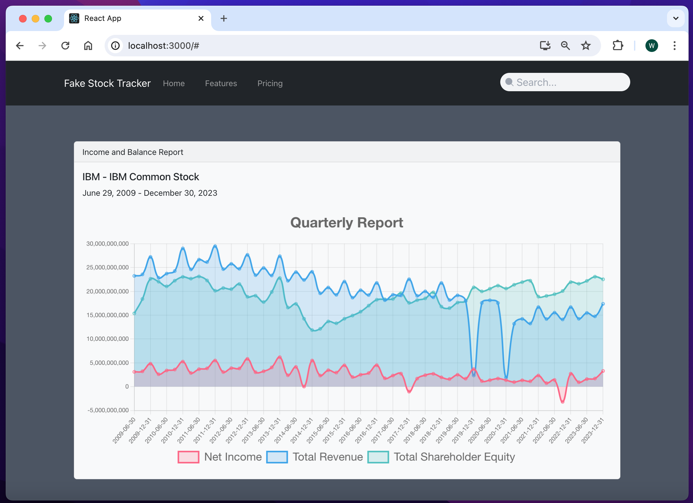

# Stock Quarterly Report App

A Stock Historical Financial Data application to illustrate using React and Redux to pull data from Alpha Vantage API and display stock
information in a chart:

1. Quarterly net income from the Income Statement.
2. Quarterly total revenue from the Income Statement.
3. Quarterly total shareholder equity from the Balance Sheet.

Exploring frontend features:

1. React
2. Chart.js
3. Redux and ReduxToolkit
4. Tailwind CSS
5. React Bootstrap

---



Backend Framework:

- None

Frontend Framework:

- **React v18.2.0:** https://react.dev/
- Node v21.6.0
- Npm v10.3.0

Frontend installed packages:

- Chart.js (responsive charts): https://www.chartjs.org/docs/latest/
- Lodash Debounce: https://dmitripavlutin.com/react-throttle-debounce/

Tailwind features:

- Tailwind CSS Spinner - Flowbite (spinner component as a loader
  indicator): https://flowbite.com/docs/components/spinner/

Note:

- Using Alpha Vantage API (Twitch endpoint to get game data): https://www.alphavantage.co/documentation/
- Using Heroicons (hand-crafted icons by makers of Tailwind): https://heroicons.com/

## Local Dev Installation

Clone the repo locally:

```sh
git clone https://github.com/wayjay4/react_stock_chart_app.git stock_financial_data_app
```

Go into stock_financial_data_app dir:

```sh
cd stock_financial_data_app
```

Install NPM dependencies (node v20.11.0, npm v10.3.0):

**Node**

```sh
nvm install 21.6.0
```

```sh
nvm use 21.6.0
```

- https://stackoverflow.com/questions/7718313/how-to-change-to-an-older-version-of-node-js

**Npm**

```sh
npm install npm@10.3.0 -g
```

- https://stackoverflow.com/questions/9755841/how-can-i-change-the-version-of-npm-using-nvm

Setup configuration:

```sh
cp .env.example .env
```

Add Alpha Vantage API url and api key to .env file:

```sh
REACT_APP_IS_DEMO=true
REACT_APP_BASE_URL=https://www.alphavantage.co/query
REACT_APP_API_KEY=
```
NOTE: if you do not have an api key, then set demo to true. You will only be able see stock information for IBM and the search field simulates stock symbol filtering. This means when you type into the field you will either see a drop down of symbols to select from or 'no match found' as it would in the non-demo setting.

Build assets:

```sh
npm install
```

```sh
npm run build
```
---

### Serve application in local development

```sh
npm run start
```

You're ready to go! Visit App in your browser!:

http://localhost:3000/

---

### Configure Alpha Vantage API connection

Follow Alpha Vantage API documentation at https://www.alphavantage.co/support/#api-key to:

- claim your free API key.

Setup app configuration:

- Open .env and add Alpha Vantage API key and set demo to false.

```sh
REACT_APP_IS_DEMO=false
REACT_APP_BASE_URL=https://www.alphavantage.co/query
REACT_APP_API_KEY=your_api_key
````

---

# Getting Started with Create React App

This project was bootstrapped with [Create React App](https://github.com/facebook/create-react-app).

## Available Scripts

In the project directory, you can run:

### `npm start`

Runs the app in the development mode.\
Open [http://localhost:3000](http://localhost:3000) to view it in your browser.

The page will reload when you make changes.\
You may also see any lint errors in the console.

### `npm test`

Launches the test runner in the interactive watch mode.\
See the section about [running tests](https://facebook.github.io/create-react-app/docs/running-tests) for more information.

### `npm run build`

Builds the app for production to the `build` folder.\
It correctly bundles React in production mode and optimizes the build for the best performance.

The build is minified and the filenames include the hashes.\
Your app is ready to be deployed!

See the section about [deployment](https://facebook.github.io/create-react-app/docs/deployment) for more information.

### `npm run eject`

**Note: this is a one-way operation. Once you `eject`, you can't go back!**

If you aren't satisfied with the build tool and configuration choices, you can `eject` at any time. This command will remove the single build dependency from your project.

Instead, it will copy all the configuration files and the transitive dependencies (webpack, Babel, ESLint, etc) right into your project so you have full control over them. All of the commands except `eject` will still work, but they will point to the copied scripts so you can tweak them. At this point you're on your own.

You don't have to ever use `eject`. The curated feature set is suitable for small and middle deployments, and you shouldn't feel obligated to use this feature. However we understand that this tool wouldn't be useful if you couldn't customize it when you are ready for it.


````
-installation: npx create-react-app fakestoreapp
-install axios: npm install axios
-installed chart.js and react-chartjs-2: https://github.com/chartjs/awesome?tab=readme-ov-file#integrations --> https://github.com/reactchartjs/react-chartjs-2
npm install react-chartjs-2 chart.js

-installed react-bootstrap: https://react-bootstrap.netlify.app/
npm install react-bootstrap bootstrap
-import bootstrap css into main app component:
import 'bootstrap/dist/css/bootstrap.min.css';

-got a free api key at: https://www.alphavantage.co/support/#api-key

-install: npm install redux react-redux
-install: npm install @reduxjs/toolkit
-install: npm install react-router-dom
````
